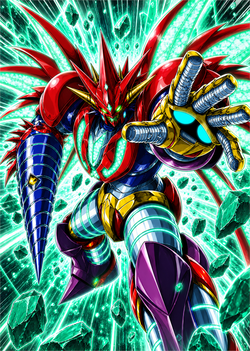
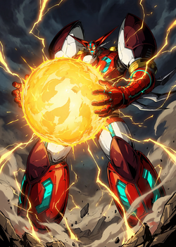
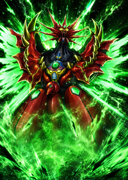

# 真盖塔模组

[English](README_EN.md) | [日本語](README_JP.md)


**让真盖塔穿越时空登上高塔。** 这是一个为《杀戮尖塔 2》制作的玩法型角色 Mod，以四种盖塔形态、战斗中变形和多套相互咬合的构筑体系，重现真盖塔不断突破极限的战斗节奏。

> 当前版本 `v0.9.42` · 最低游戏版本 `0.106.1` · Godot `4.5.1 Mono` · .NET `9` · 简体中文 / English / 日本語

## 为什么值得玩

- **四种形态，一套角色。** 在一号机、二号机、三号机与真盖塔龙之间切换，让形态选择成为每回合决策的一部分。
- **不止一条构筑路线。** 变形、气力、活力、再生、覆甲、进化与辐射等机制可以独立成型，也能交叉组合。
- **从卡牌到演出都围绕真盖塔打造。** 包含定制卡框、角色动画、VFX、语音、处刑曲和角色选择画面。
- **融入高塔，而不是停留在换皮。** 除完整卡池外，还包含专属遗物、药水、附魔、事件和先古对话。

## 内容一览

`v0.9.42` 当前注册内容包括：

- **72 张卡牌**，覆盖四种形态与多套核心机制
- **10 个遗物**、**3 瓶药水**、**2 个附魔**
- **1 个专属事件**与专属先古对话
- 中、英、日三语本地化
- DLL、PCK 与 JSON 组合加载的完整角色 Mod

## 代表性卡面

<p align="center">
  
  
  
</p>

## 当前状态

本项目仍处于**公开发布前开发阶段**。版本号、数值、内容数量以及与游戏后续版本的兼容性仍可能调整，目前不提供稳定安装包或存档兼容承诺。希望参与测试或研究实现的开发者可以从源码构建。

## 从源码构建

### 环境要求

- 《杀戮尖塔 2》`0.106.1` 或更高版本
- Godot `4.5.1 Mono`
- .NET SDK `9`
- 本机可供 Godot 加载验证的游戏工程目录

以下依赖来自本地游戏或开发环境，不纳入版本管理：

- `lib/sts2.dll`
- `lib/0Harmony.dll`
- `addons/` 中由游戏或编辑器提供的 FMOD、Spine、Sentry 等插件

准备依赖后，编译 C# 项目：

```powershell
dotnet build .\ShinGetterMod.csproj -c Debug
```

编译后的 DLL 与 PDB 会复制到被忽略的 `build/` 目录。

### 导出测试包

使用 Godot 的 `Windows Desktop` 导出预设生成 PCK：

```powershell
godot --headless --quit --path . --export-pack "Windows Desktop" .\build\ShinGetterMod.pck
```

将以下文件放入本地游戏的同一个 Mod 目录：

- `ShinGetterMod.dll`
- `ShinGetterMod.pck`
- `ShinGetterMod.json`

Godot 资源改动还应在本地游戏工程中运行 `tools/validate-mod-resources.gd`，并完成一次无界面加载验证。仓库不跟踪个人部署脚本或本机路径配置。

## 项目结构

- `src/`：卡牌、能力、遗物、药水、附魔、事件、补丁与运行时代码
- `scenes/`、`animations/`、`images/`、`materials/`、`shaders/`、`audio/`：Godot 场景与视听资源
- `ShinGetterMod/`：模组数据与本地化资源
- `tools/validate-mod-resources.gd`：导出包资源完整性检查
- `ShinGetterMod.json`：模组清单、版本与最低游戏版本

## 参与开发与反馈

公开发布前，仓库仍以集中开发和测试为主。提交问题时，请尽量附上游戏版本、Mod 版本、复现步骤和相关日志；提交代码前，请保持改动范围明确，并至少运行对应的 C# 构建。涉及 Godot 资源的改动应再通过完整的构建、资源验证与加载验证。

请勿提交本地游戏依赖、`addons/`、`build/` 产物或个人测试脚本。

## 许可与素材说明

本项目是非官方同人 Mod，与《杀戮尖塔 2》及“真盖塔”相关的名称、角色和原作素材归各自权利人所有。

仓库目前尚未附带开源许可证。在正式开放再分发与贡献前，将补齐代码许可证、第三方素材归属及使用边界；在此之前，请勿默认仓库内容已获得复制、修改或再分发授权。
