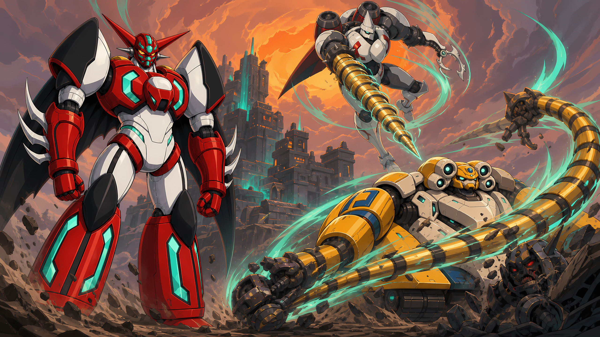

# 杀戮尖塔2 - 真盖塔模组

[English](README_EN.md) | [日本語](README_JP.md)



**三颗心脏，一台盖塔，无限进化。**

让真盖塔穿越时空登上高塔。切换一号机的爆发、二号机的高速战术与三号机的钢铁防线，最终唤醒真盖塔龙，用盖塔射线吞没高塔。这里不是换一张角色皮肤，而是一套围绕变形、卡组与演出共同运转的玩法型角色 Mod。

> 正式版 `v1.2.0`（游戏 `0.107.0+`）· 0.111 Beta 专用版 `v1.2.0-beta.111` · Godot `4.5.1 Mono` · .NET `9` · 简体中文 / English / 日本語

[下载正式版 v1.2.0 与 0.111 Beta 专用版](https://github.com/AiurArtanis/sts2-shin-getter-mod/releases/tag/mod-v1.2.0) · [提交问题](https://github.com/AiurArtanis/sts2-shin-getter-mod/issues)

## 🧪 0.111 Beta 适配

- **当前正式版游戏：**使用 `v1.2.0`（`shin-getter-mod-v1.2.0.zip`，Tag `mod-v1.2.0`）。
- **Slay the Spire 2 0.111 Beta：**使用 `v1.2.0-beta.111`（`shin-getter-mod-v1.2.0(111-beta).zip`，Tag `mod-v1.2.0-beta.111`）。
- Beta 包完整保留正式版 v1.2.0 的 77 张卡牌、四种形态、事件、语音、动画与中二配置；它不是删减版。
- 两个包不能混用。切换游戏分支后，请用对应 ZIP 的四个同名文件完整覆盖原目录，再重启游戏。
- 两个压缩包统一放在 [v1.2.0 Release](https://github.com/AiurArtanis/sts2-shin-getter-mod/releases/tag/mod-v1.2.0) 中。
- 已知外部兼容问题：旧版 `BaseLib 3.3.7` 在 0.111 Beta 中会因 `CardPileCmd.Add` transpiler 失败导致出牌卡住。请更新 BaseLib，或在 Beta 环境中禁用 BaseLib 及依赖它的模组。

## ⚡ 战斗核心

- **四种形态，一套角色。** 一号机专注活力爆发；二号机获得额外能量与抽牌，但格挡减半；三号机以覆甲和防杀反击守住阵线；真盖塔龙兼容三种形态奖励。
- **变形就是决策。** 形态专属卡会提示当前可用的强势动作。通过位移、变形牌和相关遗物，可以把换挡编入每回合的进攻节奏。
- **从卡牌到演出都围绕真盖塔打造。** 定制卡框、角色动画、VFX、语音、处刑曲与角色选择画面共同构成完整体验。
- **融入高塔，而不是停留在换皮。** 除完整卡池外，还包含专属遗物、药水、附魔、事件和先古对话。

## 🧭 新手构筑

- **活力爆发：** 累积活力后，以「热血」「俯冲打击」等牌打出高伤害终结。
- **消耗循环：** 用带消耗的卡牌触发「盖塔钩爪」的免费伤害；有「部件交换」后可回收关键组件，二号机能进一步放大输出。
- **钢铁反击：** 三号机叠覆甲、构筑格挡，在敌人回合用防杀反击压低风险。
- **变形连锁：** 围绕频繁变形、移动变形和「天选之子」组织卡组，让每次切换都转化为资源或防御。

气力会支撑部分强力效果；进化与辐射则让后期的成长路线继续分岔。先抓住一条主线，再让其他机制为它服务，通常会比平均铺开更可靠。

## 📦 内容一览

`v1.2.0` 当前注册内容包括：

- **77 张卡牌**，覆盖四种形态与多套核心机制
- **13 个遗物**、**6 瓶药水**、**2 个附魔**
- 多项**事件入侵**内容、**1 个专属事件**与专属先古对话
- 中、英、日三语本地化
- DLL、PCK 与 JSON 组合加载的完整角色 Mod

## 🆕 v1.2.0 发布说明

[下载 v1.2.0](https://github.com/AiurArtanis/sts2-shin-getter-mod/releases/tag/mod-v1.2.0)（`shin-getter-mod-v1.2.0.zip`）

- **变形与专属动画：**三种普通形态加入完整的战机分离／合体演出；真盖塔龙新增三套 30fps 专属动作，烈阳闪光弹为一号机和真盖塔龙使用独立 90 帧动画。
- **新增战斗内容：**加入先古卡「盖塔登场」、战机分离与分身表现，并为烈阳闪光弹增加战斗内特殊入手、专属预览和终结奖励。
- **事件入侵扩充：**18 个原版事件加入真盖塔路线，并新增 4 张事件牌、2 件事件遗物和 3 瓶事件药水；这些奖励不会进入普通随机池。
- **音乐与语音：**中二配置新增处刑曲及普通／事件／精英／Boss 战 BGM 的选择、随机与试听；战斗回应、低生命台词和字幕时序也得到扩充。
- **美术与界面：**更新 12 张卡牌卡面，新增彩虹 `NEW` 版本提示，并修正卡框类型、卡牌浮层及配置界面交互。
- **平衡与规则：**重做终极盖塔射线，完善烈阳闪光弹、进化引擎、大胆计划、盖塔意志与精神指令等卡牌和机制。
- **稳定性修复：**修复放射能、气力减伤、精神指令保留、腾空易伤、撕咬动画、事件奖励、多人作用域与形态语音等问题。

## 🃏 全卡卡面


## 🚀 快速上手

### 安装发布版

1. 从 [v1.2.0 Release](https://github.com/AiurArtanis/sts2-shin-getter-mod/releases/tag/mod-v1.2.0) 下载 `shin-getter-mod-v1.2.0.zip`，解压得到 `ShinGetterMod.pck`、`ShinGetterMod.dll`、`ShinGetterMod.json` 与 `mod_image.png`。
2. 在游戏的模组加载目录中创建 `ShinGetterMod` 子目录，并将四个文件放在一起。
3. 启动游戏，从主菜单进入**设置 → 模组设置**，在**已下载的模组**中启用“真盖塔模组”。
4. 确认加载提示后完全退出并重新启动游戏。新开一局，选择**真盖塔**即可开始。

### 安装 0.111 Beta 专用版

1. 确认游戏已切换到 **Slay the Spire 2 0.111 Beta**。
2. 从 [v1.2.0 Release](https://github.com/AiurArtanis/sts2-shin-getter-mod/releases/tag/mod-v1.2.0) 下载 `shin-getter-mod-v1.2.0(111-beta).zip`。
3. 将 ZIP 内四个文件完整覆盖到同一个 `ShinGetterMod` 目录；不要与正式版 v1.2.0 的 DLL／PCK 混搭。
4. 完全退出并重新启动游戏，再启用模组并新开一局。

首次游玩时，优先观察形态专属卡的高亮提示，围绕当前形态建立节奏，再逐步尝试上面的构筑路线。

### 创意工坊

创意工坊版本发布后，也可以按下面步骤启用：

1. 订阅 Mod 后启动游戏；从主菜单进入**设置**，选择**模组设置**。
2. 在**已下载的模组**列表中找到“真盖塔模组”，勾选它的启用框。
3. 出现“是否要加载模组？”提示时，确认来源可信后选择**加载模组**，然后完全退出并重新启动游戏。启用或关闭模组都要在重启后才生效。
4. 新开一局，选择**真盖塔**角色即可开始。

`v1.0.0` 是首个公开发布版本。后续游戏更新可能影响兼容性；遇到问题时，请附上游戏版本、Mod 版本、复现步骤和相关日志。

## 🗺 后续路线图

- [ ] 更多事件
- [ ] 更多超级机器人大战元素
- [ ] 同世界观敌人
- [ ] 新 BD 流派「宿命流」
- [ ] 优化动画表现
- [ ] 为精神指令卡牌添加专属卡面边框
- [ ] 多人模式适配

## 从源码构建

### 环境要求

- 《杀戮尖塔 2》当前正式版 `0.107.0+`，或与本支线对应的 `0.111.0` Beta
- Godot `4.5.1 Mono`
- .NET SDK `9`
- 本机可供 Godot 加载验证的游戏工程目录

以下依赖来自本地游戏或开发环境，不纳入版本管理：

- `lib/sts2.dll`
- `lib/0Harmony.dll`
- `addons/` 中由游戏或编辑器提供的 FMOD、Spine、Sentry 等插件

准备依赖后，编译 C# 项目：

```powershell
cd .\shin-getter-mod-godot
dotnet build .\ShinGetterMod.csproj -c Debug
```

编译后的 DLL 与 PDB 会复制到被忽略的 `build/` 目录。

### 导出测试包

使用 Godot 的 `Windows Desktop` 导出预设生成 PCK：

```powershell
godot --headless --quit --path . --export-pack "Windows Desktop" .\build\ShinGetterMod.pck
```

将以下文件放入本地游戏的同一个 Mod 目录：

- `ShinGetterMod.dll`
- `ShinGetterMod.pck`
- `ShinGetterMod.json`

Godot 资源改动还应在本地游戏工程中运行 `tools/validate-mod-resources.gd`，并完成一次无界面加载验证。仓库不跟踪个人部署脚本或本机路径配置。

## 项目结构

- `shin-getter-mod-godot/`：完整 Godot/C# 模组工程
- `shin-getter-mod-godot/src/`：卡牌、能力、遗物、药水、附魔、事件、补丁与运行时代码
- `shin-getter-mod-godot/scenes/`、`animations/`、`images/`、`materials/`、`shaders/`、`audio/`：Godot 场景与视听资源
- `shin-getter-mod-godot/ShinGetterMod/`：模组数据与中英日本地化资源
- `art/`：完整卡面 PNG 与全卡马赛克画廊
- `workshop/`：创意工坊发布文案与相关材料

## 参与开发与反馈

提交问题时，请尽量附上游戏版本、Mod 版本、复现步骤和相关日志；提交代码前，请保持改动范围明确，并至少运行对应的 C# 构建。涉及 Godot 资源的改动应再通过完整的构建、资源验证与加载验证。

请勿提交本地游戏依赖、`addons/`、`build/` 产物或个人测试脚本。

## 许可与素材说明

本项目是非官方同人 Mod，与《杀戮尖塔 2》及“真盖塔”相关的名称、角色和原作素材归各自权利人所有。

本仓库中的原创代码以 [MIT 许可证](LICENSE) 发布。该许可证不授予《杀戮尖塔 2》、“真盖塔”或其他第三方素材的复制、改编、再分发权限；使用者仍须自行确认相关权利与素材来源。
